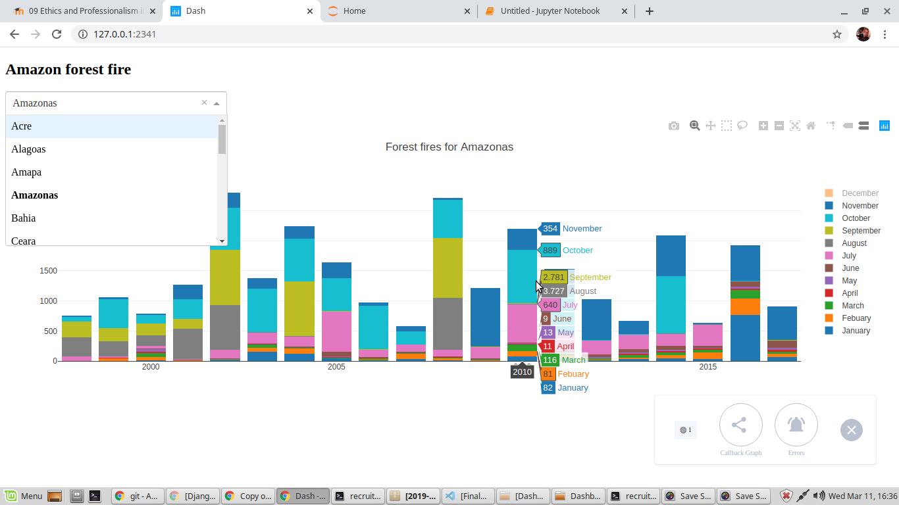

# Dashboard1
This is a visualisation of forest fires in different states over Years.

The Dashboard allows you to filter by different states over a selected period of time.

Context
Forest fires are a serious problem for the preservation of the Tropical Forests. Understanding the frequency of forest fires in a time series can help to take action to prevent them. Brazil has the largest rainforest on the planet that is the Amazon rainforest.

Content
This dataset report of the number of forest fires in Brazil divided by states. The series comprises the period of approximately 10 years (1998 to 2017). The data were obtained from the official website of the Brazilian government.

http://dados.gov.br/dataset/sistema-nacional-de-informacoes-florestais-snif

Acknowledgements
We thank the brazilian system of forest information

Inspiration
With this data, it is possible to assess the evolution of fires over the years as well as the regions where they were concentrated. The legal Amazon comprises the states of Acre, Amapá, Pará, Amazonas, Rondonia, Roraima, and part of Mato Grosso, Tocantins, and Maranhão.

Task
Format the months into English
Which states experienced the most Forest fires?
Which years experienced the most Forest fires?
Which months, for one year, had the most Forest fires?

